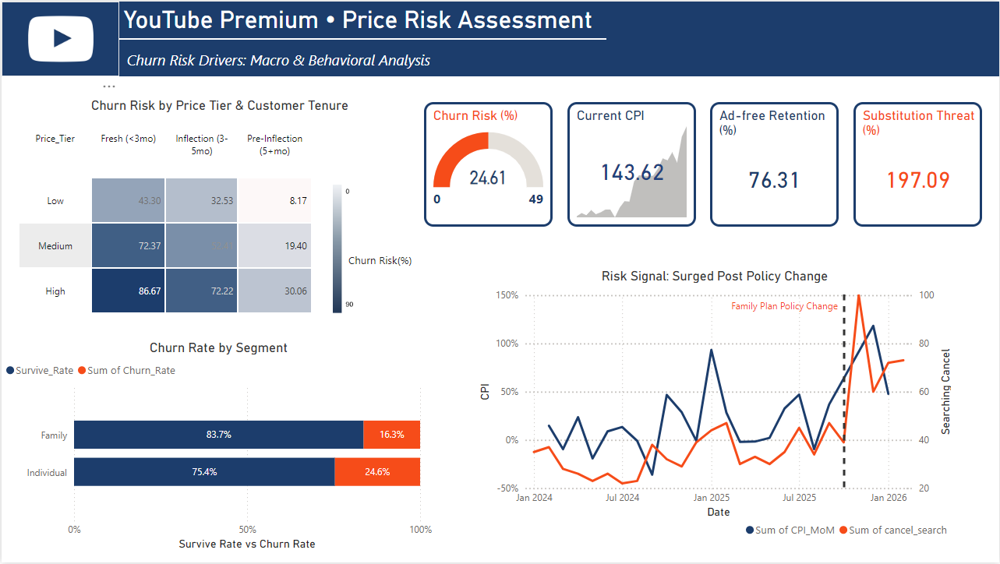
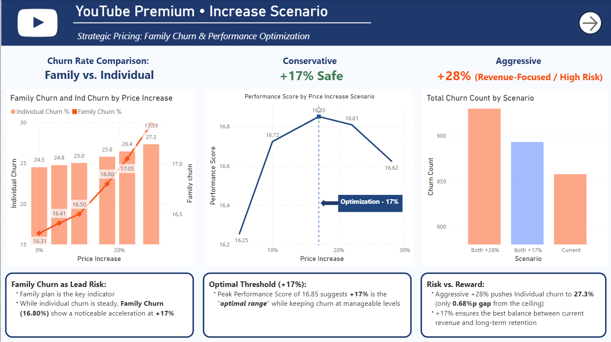
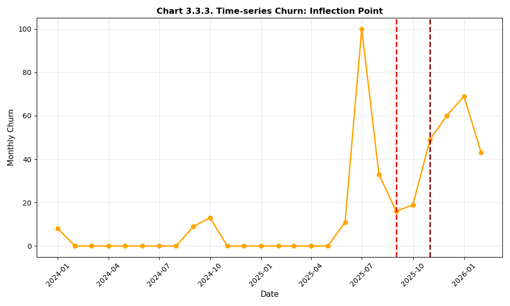
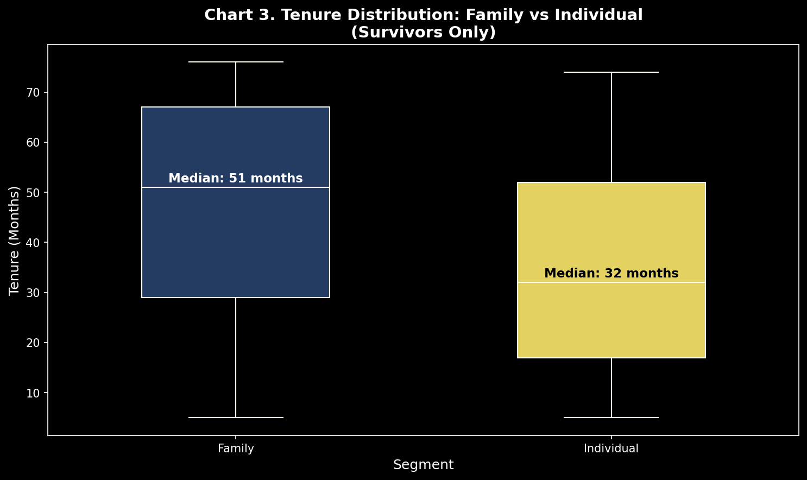
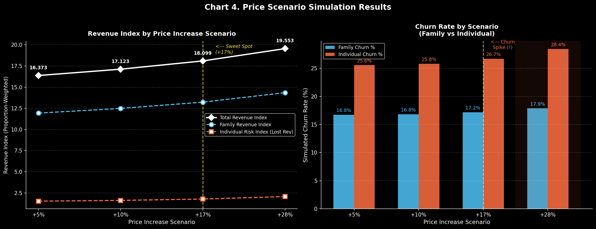

# YouTube Churn Price Risk Assessment
> Analyzing pricing scenarios to balance revenue growth and subscriber retention.

  
  

---

## Overview

In September 2025, YouTube's Family Plan policy change triggered an immediate churn surge. This project started from a simple question: was this spike just a temporary reaction, or does it reflect underlying price sensitivity across different customer segments?

To explore this, I analyzed how churn behavior changes under different pricing scenarios and how far pricing can be adjusted without triggering excessive retention loss.

The analysis suggests that a +17% price increase provides a reasonable balance between revenue growth and churn risk.

---

## Key Findings

| Insight | Evidence |
|---|---|
| Policy change caused abnormal churn | 6.29 → 36.65 churn/month |
| Family users are structurally more resilient | 16.3% vs 24.6% churn rate |
| Price elasticity threshold occurs near $75 | Churn accelerates beyond this point |

- A **+17% price increase** shows a balanced outcome — revenue increases without a sharp rise in churn  
- A **+28% price increase** leads to a clear churn increase, especially among Individual plan users  
- Family plan subscribers show lower churn than Individual users (**χ² = 52.97, p = 3.95e-53**)

---

## Visualizations

### Chart 1: Time-Series Churn with Policy Inflection
Monthly churn rose from **6.29 → 36.65** following the policy announcement.

  

---

### Chart 2: Family vs Individual Churn Gap
- Family: 16.3% churn, 51-month median tenure  
- Individual: 24.6% churn, 32-month median tenure  

  

---

### Chart 3: Price Scenario Simulation Results
Four scenarios tested: +5%, +10%, +17%, +28%

  

→ Revenue increases with price, but churn rises more sharply beyond +17%, particularly for Individual users.

---

## Methodology

### Data
- Telco subscription dataset (Kaggle) used as a behavioral proxy for YouTube Premium  
- **5,534 records (cleaned dataset)** with 21 features  
- Structural similarity checked against Pew Research YouTube usage patterns  

### Validation Approach

**H1 – Policy Shock**  
Welch's t-test comparing baseline (Jan–Aug) vs policy period (Sep–Jan). July outlier removed using IQR method

**H2 – Family Resilience**  
Chi-square test of independence, segmented by Family vs Individual plans, evaluated at 6 months post-policy

**H3 – Price Threshold**  
Chi-square test: price tier × churn. Sample restricted to 5+ month tenure customers  
Elasticity curve estimated across price tiers.

**Simulation**  
Four price scenarios (+5%, +10%, +17%, +28%) were applied based on observed churn patterns

**Limitations**
- Proxy dataset — directionally useful but not exact  
- Competitive reactions and product changes not included  
- Observation window: Jan 2025 – Jan 2026  

📄 Full proxy validation: `/report/data_proxy_validation.md`

---

## Tech Stack

`Python` `Pandas` `NumPy` `SciPy` `Matplotlib` `Seaborn` `Jupyter Notebook` `VS Code` `Power BI` `GitHub`

---

## AI-Assisted Development

This project was developed with the help of AI tools to improve efficiency during implementation

- AI was used to support code generation, debugging, and visualization setup  
- Outputs from AI were reviewed and adjusted before being used  
- All analysis design, statistical validation, and interpretation were done by me  

The goal was to use AI as a tool while keeping full responsibility for the analysis and conclusions
