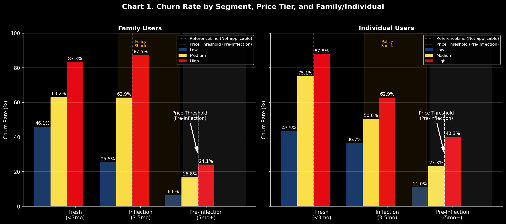
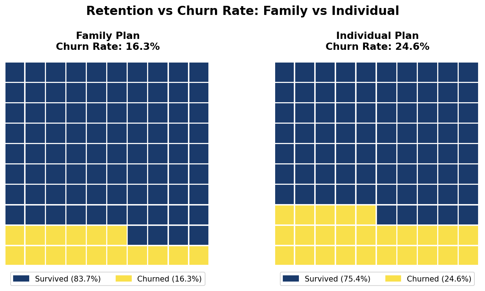
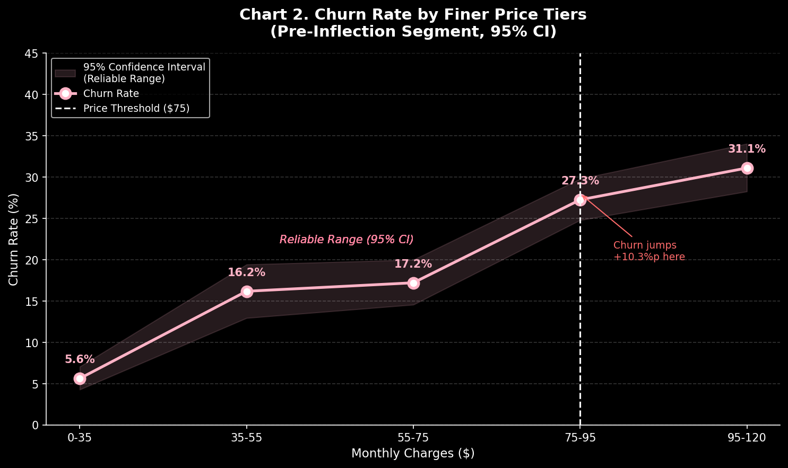

# Title: YouTube Churn Price Risk Assessment
- Dashboard Images

  
  

## Executive Summary
Executive Summary
In September 2025, YouTube announced a Family Plan policy change (implemented October 1) that immediately triggered elevated customer churn. This project investigates whether the churn surge represents a valid market signal about customer segmentation and price elasticity in the remaining customer base, and recommends an optimal price increase magnitude and timing.

### Finding
- The analysis suggests that a price increase of about **+17%** could be viable based on three observed patterns in churn behavior.
- Family plan subscribers show lower churn than individual users (16.3% vs 24.6%, χ² = 52.97, p < 0.001)

  

## Key Insights Summary
<table align="center">
  <thead>
    <tr>
      <th>Insight</th>
      <th>Evidence</th>
    </tr>
  </thead>
  <tbody>
    <tr>
      <td>Policy change caused abnormal churn</td>
      <td>6.29 → 36.65 churn/month</td>
    </tr>
    <tr>
      <td>Family users are structurally more resilient</td>
      <td>16.3% vs 24.6% churn</td>
    </tr>
    <tr>
      <td>Price elasticity threshold occurs near $75</td>
      <td>Churn accelerates beyond this point</td>
    </tr>
  </tbody>
</table>

<table align="center" border="0">
  <tr>
    <td></td>
    <td></td>
    <td></td>
  </tr>
</table>

## Key Visualization
### Chart 1: Time -Series Churn with Policy Inflection
- Policy change triggered a sharp churn increase.
- Monthly churn rose from 6.29 → 36.65 after the policy announcement.

  

### Chart 2: Family vs Individual Churn Gap
- Family: 16.3% churn, 51-month median tenure
- Individual: 24.6% churn, 32-month median tenure

  

### Chart 3: Price Scenario Simulation Results
<table align="center" border="1" style="border-collapse: collapse; width: 100%;">
  <thead>
    <tr style="background-color: #f2f2f2;">
      <th style="padding: 10px; width: 50%;">Left Panel: Revenue Index</th>
      <th style="padding: 10px; width: 50%;">Right Panel: Churn Rate</th>
    </tr>
  </thead>
  <tbody>
    <tr>
      <td style="padding: 10px; vertical-align: top;">
        <ul>
          <li><strong>Total Revenue:</strong> Trajectory across 4 scenarios.</li>
          <li><strong>Family Revenue:</strong> Stable growth pattern.</li>
          <li><strong>Individual Risk:</strong> Accelerating after +17%.</li>
          <li><strong>Sweet Spot:</strong> Identified at +17% increase.</li>
        </ul>
      </td>
      <td style="padding: 10px; vertical-align: top;">
        <ul>
          <li><strong>Family Churn:</strong> Remains resilient (blue bars).</li>
          <li><strong>Individual Churn:</strong> Higher baseline sensitivity.</li>
          <li><strong>Threshold:</strong> Churn spike visible at +28%.</li>
        </ul>
      </td>
    </tr>
  </tbody>
</table>

  

## Method Overview
### Data
- Telco subscription dataset (Kaggle) used as a behavioral proxy for YouTube Premium
- 5,534 recirds with 21 features 
- Structural similarity validated against **Pew Research YouTube usage patterns**

### Validation Approach
**1. H1 – Policy Shock**
- Welch’s t-test comparing baseline (Jan–Aug) vs policy period (Sep–Jan)
- July outlier removed using IQR method

**2. H2 – Family Resilience**
- Chi-square test of independence
- Segmentation: Family vs Individual plans
- Evaluated at Feb 2026 (6 months post-policy)

**3. H3 – Price Threshold**
- Chi-square test: price tier × churn
- Sample restricted to 5+ month tenure customers
- Elasticity curve estimated across price tiers

**4. Simulation**
- Four price scenarios tested **(+5%, +10%, +17%, +28%)**
- Churn projections mapped onto observed elasticity curve

**5. Limitations**
- **Proxy dataset → magnitude directional, trend reliable**
- Competitive reactions and product changes not modeled
- Observation window: Jan 2025 – Jan 2026

**6. Full proxy validation:** /report/data_proxy_validation.md

## Tech Stack
- Python (Pandas, NumPy, SciPy)
- Visualization: Matplotlib, Seaborn
- Environment: Jupyter Notebook, VS Code
- Version Control: GitHub
- Dashboard: Power BI

## Development & Analytical Workflow
- This project was completed using an **AI-assisted development workflow** while I maintained **full ownership** of the analytical direction and business insights.

#### 1. AI-Assisted Implementation 
##### I leveraged AI tools (primarily Claude) to accelerate:
- Exploratory brainstorming for statistical approaches
- Python code generation, debugging, and optimization
- Data visualization design and implementation
- Documentation structuring and polishing

#### 2.  Analyst-Led Decision Making
##### All critical analytical decisions were driven by me, with AI as a supportive collaborator:
- Defining the core business problem (customer churn and price elasticity)
- Selecting and evaluating appropriate statistical methods
- Verifying test assumptions and validating results
- Interpreting findings and uncovering actionable insights
- Translating analysis into clear business recommendations

#### 3. Outcome
- AI significantly sped up the technical implementation (coding, visualization, and documentation), allowing me to focus more deeply on analytical reasoning and strategic thinking. 
- The entire process—from initial data exploration to final recommendations—took approximately three weeks.

**This reflects my approach as a Junior Data Analyst using modern tools efficiently while taking full responsibility for the quality and integrity of the analysis.**

## 